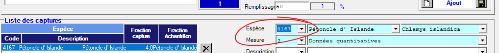

# Codes espèce: Saisie vs archivage

Il faut faire une distinction entre le codes espèces pour les besoins de de saisie et codes espèces pour les besoins d'archivage.
Bien que historiquement les deux sont les mêmes, ils jouent un rôle différent et ne doivent pas obligatoirement être les memes, ou suivre la même norme.

## Saisie avec Andes
Les codes d'espèces jouent un rôle important dans le mécanisme de saisie.
L'insertion d'une capture est fait obligatoirement par l'entremise d'une code d'espèce.
Une mission doit en premier lieu définir la norme de codes a être utilisé. Les normes sont généralement soit STRAP ou RVAN, mais rien n'empeche l'utilisation d'autres codes. la définition de codes en vigueur pour la de mission peut-être completement arbitraire.

Tel était le cas pour la mission IML-2023-011, où une liste de codes spéciale a été créer spécifiquement pour saisie des espèces sans codes STRAP.
Cette liste était essentiellement identique a la liste de codes STRAP sauf pour l'ajout d'une douzaines d'espèces (ceux ci avait un code arbitraire assigné entre 1000-1050).
Le but était d'utiliser cette liste seulement pour permettre d'utiliser le mécanisme de saisie Andes, l'intention était de retirer les codes arbitraires en favorisant plutot un  `aphia_id`` lors de l'étape de publication ou archivage.

Bien que Andes ne permet pas de saisie sans codes, il serait envisageable de modifier le mécanisme de saisie pour permettre la saisie via un nom commun, aphia_id, nom scientifique, ... voir billet [#1040](https://github.com/dfo-gulf-science/andes/issues/1040). En attendant, il va falloir créer des liste spéciale avec des codes temporaires de saisie (technique utilisé pour IML-2023-011) ou maintenir la liste STRAP a jour.

## Archivage dans la BD Peche Sentinelle (Oracle)
Les nature des données derrière une BD peut facilement être mal transmise (voir même obfusquer) par l'outil graphique qui interface avec l'utilisateur.
De façon générale, les utilisateurs intéragissent avec la BD purement via un outil d'interface graphique. L'outil en question pourrait imposer certain restrictions et donner de fausses impréssions ces restriction proviennent de a la BD sous-jacente.

### Mythe des codes STRAP
Mythe: Un entré de capture dans la BD Peche Sentinelle doit avoir un code STRAP.

Prennons l'example de la saisie de l'espèce *Chlamis Islandica* par l'entremise de l'outil `Saisie Pétoncle`. Elle pourrait laisser sous-entendre que le code strap `4167` doit être associé a cet espèce, voir figure:

L'espece peut être choisi par nom common, nom scientifique, ou code STRAP, les trois sont liées, impossible d'en choisir un sans l'autre.

Étant donné que c'est l'interface graphique principalement utilisé pour saisie des données Pétoncles vers la BD `Peche Sentinelle`, 
cette impréssion pourrait facilement être généralisé vers la fausse croyance qu'un espèce doit avoir un code STRAP pour etre permise dans la BD `Peche Sentinelle`.

En réalité, l'entrée a une clé primaire `COD_ESP_GEN=48` a une relation vers le code `4167` (de la table `espèce_NORME`) via le choix de la norme `STRAP_IML` (table `NORME`)
.
En principe, un choix de la norme `aphiaId` (ou un autre) pourrait être fait. La table `espèce_NORME` permet une relation avec plusieures normes.
Cela offre le potentiel d'ajouter l'occurence d'espèces sans qu'ils soient présent dans la liste de codes `STRAP_IML`.
Meme que la liste spéciale avec des code temporaires utilisé dans Andes pourrait potentiellement etre importer dans la BD Peche Sentinelle (pas recommandé).

### Mythe des codes dupliquées
Mythe: Impossible de saisie plusieurs captures qui partage le meme code.

Bien que cette example s'applique pour la table `CAPTURE` (et non la table `CAPTURE_MOLLUSQUE`), elle illustre bien la confusion que peuvent causer un manque de distinction entre un outil de saisie et sa BD associée. L'outil `Relevé de Recherche` offre un interface graphique à la BD Peche Sentinelle sur Oracle. Les captures sont saisie en premier lieu par l'interface, et ensuite insérées dans la table `CAPTURES` de la BD apres avoir passé certaines critères de validation. L'une de ces critères empèche l'insertion de deux entrées ayant le meme code d'espèce. La figure ci bas montre le méssage d'érreur suite a une tentative d'insérer une deuxieme capture de raie épineuse.

Une inspection des contraintes de cette table dévoile une clé primaire composé de `SEQ_CAPTURE` et `COD_ESP_GEN`. Étant donné que la collonne `SEQ_CAPTURE` submit une incrémentation automatique pour chaque entrée, la clé primaire sera toujours unique, et ce, peux importe la valeur de `COD_ESP_GEN`. Du point de vue de la BD, il a aucune raison valable d'interdire un duplicat de codes dans la meme capture. Cette contrainte, purement artificiel, est appliqué par l'interface graphique et non la BD elle-meme.

Il est éffectivement possible d'insérer les captures ayant le même code en intéragissant directement avec la BD via un interface de programmation. Il éxiste de bonne raisons de vouloir dupliquer des codes d'espèce dans la meme capture. Malheureusement, la table `CAPTURE_MOLLUSQUE` ne permet pas de duplicat de codes car sa clé primaire n'est pas composé avec un valeur unque comme `SEQ_CAPTURE`. Il serait bien d'également pouvoir profiter du même mécanisme.

