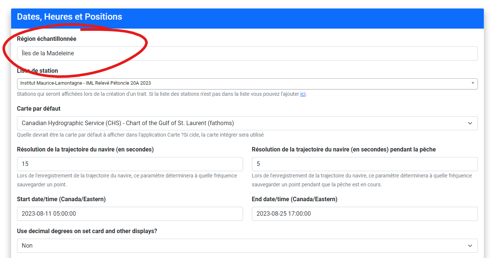

# Contraintes pour Pétoncle

## Numéro de mission alternatif et `NO_RELEVE`

Un champ critique des la BD PSE, `NO_RELEVE` (numéro du relevé) doit être obtenu par un DBA de la DAISS. Ce champ était présent dans le fichier Access fourni pas la DAISS.
Une fois que le numéro de relevé à été désigné pour la mission, il doit être saisie dan andes via le champ de mission "Numéro de mission alternatif", voir figure.


## Distance de trait visée par la mission


Dans l'ancien outil de saisie, il faut saisir des métadonnées de mission tel que i) la vitesse visée ($v$), ii) la durée visée ($t$) et ii) la distance visée ($d$) comme trois variables indépendantes. Étant donnée la relation $v=d t$, il ne peut q'avoir deux variables indépendents (il est donc possible sur l'ancien outil de saisir des valeurs invalides).

La vitesse, ayant un impacte sur la performance de drague, mérite d'etre traité comme variable indépendente. Il reste donc a faire le choix arbitraire entre un temps visée ou une distance visée, selon la discrétion du chef de mission.

Andes impose comme métadonnées de mission, que la saisie de la vitesse visée, ainsi que la durée visée soit traité comme variables indépendentes, et donc distance est dérivées de ces derniers, voir figure.

Dans les situations ou la distance devait être traité somme variable indépendent au lieu de la vitesse,  il était jugé plus simple de seulement pré-calculé et saisir la durée requise pour donner la distance voulu. Cette approche étant la plus simple ne demande aucune modifications d'Andes. Un durée de `8,09935205` minutes à un vitesse de `2,0` noeuds est de 500 mètres (soit `0.269978` miles nautiques).

N.B. Ces distances sont utilisé comme métadonnées de mission. Il est possible que la distances visées de traits différent entre les stations. Ceux-ci devront être saisie autrement.

## Déscription de mission


Doit corréspondre à une entrée de la table `PROJET_MOLLUSQUE` ayant une valeur éxistante pour la colonne `DESC_SOURCE_INFO_F`

Pour les mission pétoncle, un de ces choix:
 - `Évaluation de stocks IML - Pétoncle I de M`
 - `Évaluation de stocks IML - Pétoncle Minganie`
Pour les missions buccin: 
- `Relevé buccin Haute Côte-Nord`

## Région échantilonnée -> Secteur du relevé



Doit corréspondre à une entrée de la table `TRAIT_MOLLUSQUE` ayant une valeur éxistante pour la colonne `DESC_SECTEUR_RELEVE_F`

Pour les mission pétoncle, un de ces choix:
 - `Îles-de-la-Madeleine`
 - `Côte-Nord`
Pour les missions buccin:
- `Haute Côte-Nord`

Pour les missions buccin:
- `Haute Côte-Nord`

### ATTENTION!

Certaine tables de reference n'ont pas les memes valeurs entre la BD de MS Access la BD Peche_Sentinelle (IMLP). En cas de doute la BD PecheSentinelle devrait etre considéreé comme étant la bonne.
Cetaines Tables/colonnes ne sont pas présente dans la BD Access.

#### PROJET_MOLLUSQUE
Table:  `PROJET_MOLLUSQUE` 

Inconsistance dans le nom de colonne 
 - IMLP: `REM_PROJET_MOLL`
 - ACCESS: `REM_PROJ_MOLL`

#### TRAIT_MOLLUSQUE
les colonnes:

 - `DATE_HRE_DEB_TRAIT`
 - `DATE_HRE_FIN_TRAIT`
 - `SALINITE_FOND`
 - `SALINITE_FOND_P`
 - `COD_TYP_ECH_TRAIT`
 
Ne sont pas dans la table `TRAIT_MOLLUSQUE` de la BD Access, mais est presente dans sur IMLP.
Étant donné que ces valeurs peuvent etre null (et le sont pour la plupart des relevées récents), nous allons simplement insérer une valeur null.
(relevé 32 a trois traits avec une valeur non null !?)
#### TYPE_ECHANT_TRAIT
La table IMLP `TYPE_ECHANT_TRAIT` n'éxiste pas dans la BD ACccess:


#### TYPE_HEURE
- IMLP
 - 0 -> Normale Standard
 - 1 -> Avancée Daylight saving
 - 2 -> GMT GMT

- Acces
 - 0 -> Normale Standard
 - 1 -> Avancée Daylight saving

Donc meme si Andes utilise l'heure GMT (selon les bonnes pratiques) l'option n'éxiste pas dans Access, donc les dates/heures sont converti en heure normal standard de l'est (EST).

#### SECTEUR_RELEVE_MOLL
Certaine tables de reference n'ont pas les memes valeurs entre la BD de MS Access la BD Peche_Sentinelle (IMLP). En cas de doute la BD PecheSentinelle devrait etre considéreé comme étant la bonne.

Table:  `SECTEUR_RELEVE_MOLL` 
Colonne: `DESC_SECTEUR_RELEVE_F`

IMLP: `Îles-de-la-Madeleine`
ACCESS: `Îles de la Madeleine`

IMLP:
| COD_SECTEUR_RELEVE | DESC_SECTEUR_RELEVE_F | SECTEUR_RELEVE |
|--------------------|-----------------------|----------------|
| 1                  | Côte-Nord             | C              |
| 2                  | Estuaire              | E              |
| 3                  | Gaspésie              | G              |
| 4                  | Îles-de-la-Madeleine  | I              |
| 5                  | Québec                | Q              |
| 6                  | Basse Côte-Nord       | B              |
| 7                  | Haute Côte-Nord       | H              |
| 8                  | Moyenne Côte-Nord     | M              |
| 9                  | Anticosti             | A              |


Le problème est évité en suivant un approche plus robuste en fesant le lien via la valeur dans la colonne `SECTEUR_RELEVE`.

Cette valeur est extrait de la premier lettre (apres un nettoyage d'accents et mont en majuscules) du champ Andes `Région échantilonnée`.
Nous pouvons donc choisir de saisie la région `Îles-de-la-Madeleine` ou `Îles de la Madeleine` sans problèmes car dans les deux cas, le charactère `I` sera utilisé pour `SECTEUR_RELEVE` afin d'obtenr le code `4` requis. Par contre, il faut s'assurer que tout nouvelles entrées soit compatible avec cette approche.

#### SOURCE_INFO
Certaine tables de reference n'ont pas les memes valeurs entre la BD de MS Access la BD Peche_Sentinelle (IMLP). En cas de doute la BD PecheSentinelle devrait etre considéreé comme étant la bonne.

IMLP: `Évaluation de stocks IML - Pétoncle Îles-de-la-Madeleine`
MSACCESS:` Évaluation de stocks IML - Pétoncle I de M`

IMLP:

| COD_SOURCE_INFO | COD_CLASSE_PROJET | DESC_SOURCE_INFO_F                                           | DESC_SOURCE_INFO_A                                          |
|-----------------|-------------------|--------------------------------------------------------------|-------------------------------------------------------------|
| 18              | 7                 | Évaluation de stocks IML - Pétoncle Minganie                 | MLI Stocks' assessment - Scallop Minganie                   |
| 19              | 7                 | Évaluation de stocks IML - Pétoncle Îles-de-la-Madeleine     | MLI Stocks' assessment - Scallop Magdellan Islands          |
| 22              | 7                 | Évaluation de stocks IML - Buccin Haute-Côte-Nord             | MLI Stocks' assessment - Whelk High North Shore             |
| 23              | 9                 | Évaluation de stocks IML - Homard                            | MLI Stocks' assessment - Lobster                            |
| 25              | 7                 | Évaluation de stocks IML - Buccin Îles-de-la-Madeleine       | MLI Stocks' assessment - Whelk Magdellan Islands            |
| 26              | 7                 | Évaluation de stocks IML - Mactre de Stimpson                | MLI Stocks' assessment - Stimpson's Surf Clam               |
| 28              | 7                 | Évaluation de stocks IML - Concombre de mer Gaspésie             | MLI Stocks' assessment - Sea Cucomber Gaspésie              |
| 29              | 7                 | Évaluation de stocks IML - Concombre de mer Minganie             | MLI Stocks' assessment - Sea Cucomber Minganie              |
| 30              | 1                 | Recherche écosystémique - Communautés benthiques             | Ecosystemic research - Benthic communites                   |
| 32              | 7                 | Projets de recherche - Mollusques                            | Research projects - Mollusks                                |

Il pourait etre envisageable de faire comme avec `DESC_SERIE_HIST_F`
```python
DESC_SERIE_HIST_F = f"Indice d'abondance zone {self.zone} - {self.espece}"

DESC_SOURCE_INFO_F = f"Évaluation de stocks IML {self.zone} - {self.espece}"

```

#### ENGIN_MOLLUSQUE
Certaine tables de reference n'ont pas les memes valeurs entre la BD de MS Access la BD Peche_Sentinelle (IMLP). En cas de doute la BD PecheSentinelle devrait etre considéreé comme étant la bonne.

La colonne `REM_ENGIN_MOLL` dans la table `ENGIN_MOLLUSQUE` existe sur IMLP, mais n'est pas présente sur Access.


#### TYPE_PANIER
Certaine tables de reference n'ont pas les memes valeurs entre la BD de MS Access la BD Peche_Sentinelle (IMLP). En cas de doute la BD PecheSentinelle devrait etre considéreé comme étant la bonne.

IMLP:
|COD_TYPE_PANIER  | DESC_TYPE_PANIER          |
|-----------------|---------------------------|
|0                |Pas de panier dans l'engin |	
|1                |Panier standard            |
|2                |Panier doublé              |

ACCESS:
|COD_TYPE_PANIER  | DESC_TYPE_PANIER          |
|-----------------|---------------------------|
|1                |Panier standard            |
|2                |Panier doublé              |
|3                |Aucun                      |	

Il faudrait chercher (et valider) l'existance de type `0` et `3` dans ACCESS et IMLP (respectivement).

#### CAPTURE_MOLLUSQUE
Certaine tables de reference n'ont pas les memes valeurs entre la BD de MS Access la BD Peche_Sentinelle (IMLP). En cas de doute la BD PecheSentinelle devrait etre considéreé comme étant la bonne.

La colonne `REM_CATURE_MOLL` dans la table `ENGINCAPTURE_MOLLUSQUE_MOLLUSQUE` existe sur IMLP, mais n'est pas présente sur Access.


## Résumeé de contraintes où les valeurs sur Andes doivent correspondre avec Oracle
Évaluation de stocks IML - Pétoncle I de M
|Andes   | PSentinelle   | exemple   | notes |
|--------|---------------|----------|-------|
|`shared_models_cruise.description`  |`PROJET_MOLLUSQUE.DESC_SOURCE_INFO_F`   |`Évaluation de stocks IML - Pétoncle I de M` | texte verbatim|
|`shared_models_cruise.area_of_operation`  | `TRAIT_MOLLUSQUE.SECTEUR` | `Côte-Nord` | Permiere lettre seulement (devient `C`)
|`shared_models_station.name`  | `TRAIT_MOLLUSQUE.NO_STATION` | `N531` | Parti numérique extrait (devient `531`) |
|`shared_models_stratificationtype.description_fra`|`TYPE_TRAIT.DESC_TYP_TRAIT_F`| `Échantillonnage aléatoire` | map manuel, (devient `Aléatoire simple`)|